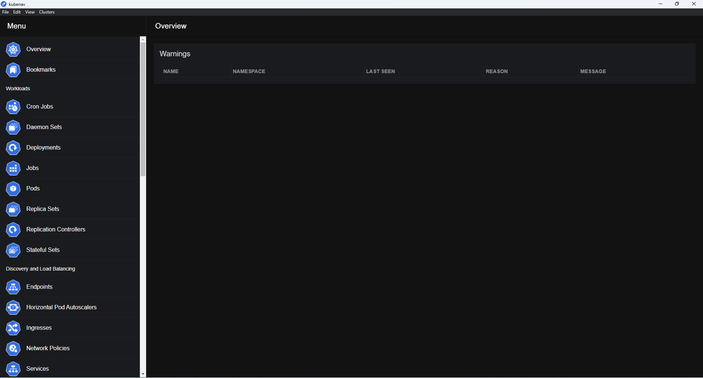

# Getting started with MAIA

In order to access the MAIA cluster resources, **kubectl** need to be installed on your local computer.
**Kubectl** is the native Kubernetes CLI, used to communicate and run commands in the cluster.
Alternatively, [**KubeNav**](https://kubenav.io/) GUI can be used with the same  purpose.

## Kubectl installation

To install the **kubectl** tool, follow the instructions provided by the official [Kubernetes documentation](https://kubernetes.io/docs/tasks/tools/).

Recommended installation procedures:

*Windows* :

  1. [Install Chocolatey](https://chocolatey.org/install)
  2. Run ```choco install kubernetes-cli```

*Linux*: [Install with native package manager](https://kubernetes.io/docs/tasks/tools/install-kubectl-linux/#install-using-native-package-management)

*MacOS*: [Install with HomeBrew](https://kubernetes.io/docs/tasks/tools/install-kubectl-macos/#install-with-homebrew-on-macos)

## Helm Installation (optional)

MAIA is using [Helm](https://helm.sh/) to deploy, revise and control applications and user environments in the cluster.
In order to be able to perform such operations, install Helm following the instructions at the following link: [https://helm.sh/docs/intro/install/](https://helm.sh/docs/intro/install/)

## KubeNav installation (optional)

KubeNav provides a GUI to interact, monitor and communicate with the cluster. The simple and intuitive interface makes it easy to install and use for users who prefers to use graphical interfaces instead of CLI tools (*kubectl*) to run commands in the cluster.


*KubeNav Interface*

To install KubeNav, follow the instructions given in the [official website](https://kubenav.io/).
To properly run, KubeNav requires the YAML configuration file saved as `~/.kube/config` (see [MAIA User Authentication](user_authentication.md))