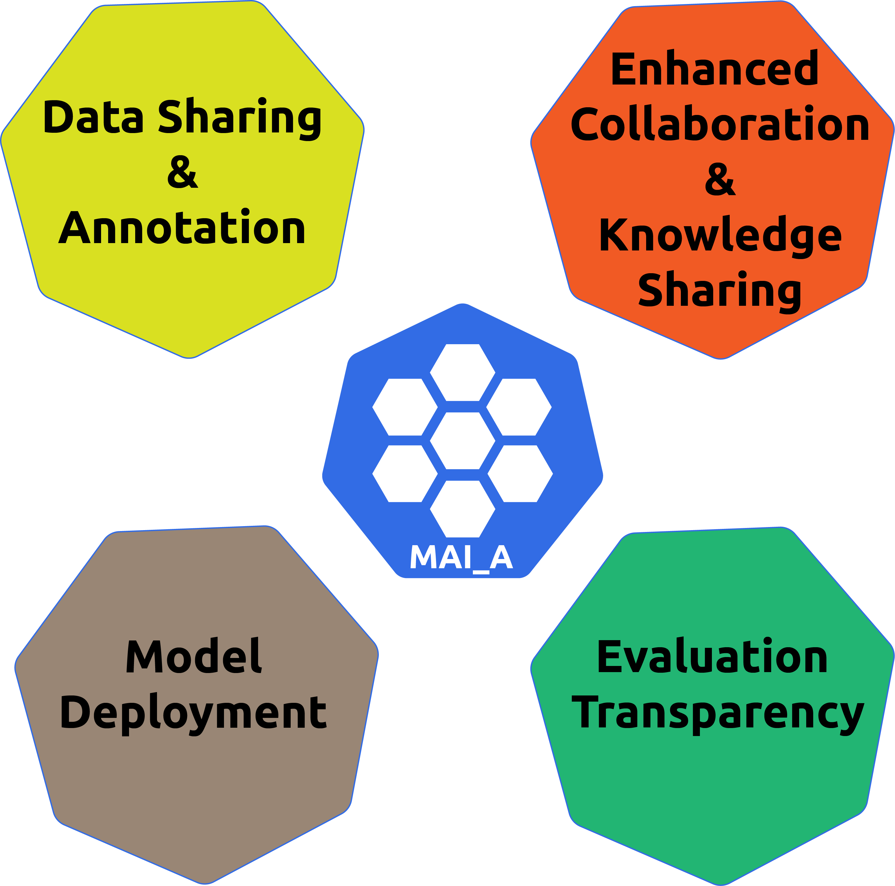

# MAIA
## Medical Artificial Intelligence Aggregator

From the "State of Intentions" document, drafted after MICCAI 2022:

---
## AI Platform for Joint Collaborations in the Medical Field

In recent years, the Medical AI community has identified four primary open issues to address in order to successfully promote the integration of AI technologies in the medical and healthcare field.

The first and most important key aspect is how to bring together clinical and technical expertise, with the aim to fuse and **exchange the respective knowledge**, with the ultimate aim to **promote the active participation of clinicians in AI development**, not considering them as merely final passive users anymore. 

Since AI heavily relies on the amount of data available, a second aspect to be addressed is dedicated to **open-access data sharing** and optimizing the time required and the quality to annotate such data.

In order to build trustworthiness around the developed AI model, one fundamental aspect to be considered is the **model evaluation transparency**. When validating an AI model in the training process, all the available performance metrics should be collected and made available for all the interested use to analyze further and provide evidence on the AI model's performance, robustness and generalization capabilities.

Finally, since the ultimate aim of integrating AI in the medical field is to provide access to tools that can assist clinicians in the decisional process, the **model availability and deployment** for testing and usage in the clinical practice must be considered.

Given all the aspects mentioned above, a modular AI platform which aims to integrate and promote collaborations in the medical field should implement the following core values:

1. **Enhanced Collaboration and Knowledge Sharing**: an environment to bring the users together in a common standard workspace and learn how to prepare data, pre-process, train and validate the AI model.
2. **Data Sharing and Annotation**: a module to provide an open-access platform where the data are stored and made available for future users. In addition, tools are provided to efficiently annotate unlabelled datasets, including AI tools to optimize the time required for data annotation.
3. **Evaluation Transparency**: a module for sharing the AI model performances in terms of validation scores, freely and interactively accessible.
4. **Model Deployment**: a module to make the AI-trained model accessible and user-friendly for users who want to test it on private and unseen data or to adopt it and integrate the AI model into the clinical routine as decision-making support for clinicians (i.e. support for diagnosis).
---

The ultimate aim of MAIA is to develop and establish a common framework to promote and facilitate the development of AI tools in the clinical context, with a particular focus on the final deployment of such tools in a real use-case scenario.
