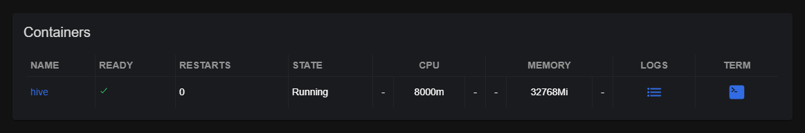
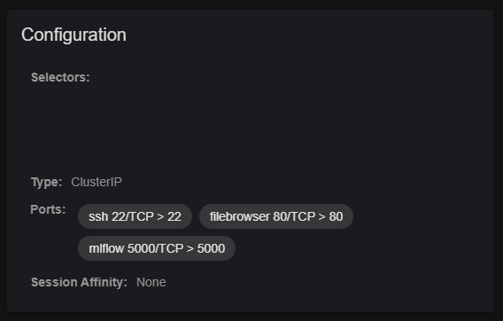
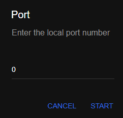

# Access MAIA Resources

To access the resources (pods) on the cluster, two different options are available: a direct pod access (either with *
kubectl* or *KubeNav*),
and a port-forwarding to access the services on the *localhost* address.

## Direct Pod Access

### Kubectl Access

To access a pod as root with *kubectl*, run:

```
kubectl exec -it POD_NAME bash
```

### KubeNav access

To access a pod as root with *KubeNav*, navigate on the interface to find the pod, then, inside the **Container** space,
click on the `TERM` icon:


## Port forwarding and service access

### Kubectl port-forwarding

In order to access the available services (`kubectl get svc`), you can forward the remote cluster port to a local port:

```
kubectl port-forward svc/SERVICE_NAME LOCAL_PORT_1:REMOTE_SERVER_PORT_1 LOCAL_PORT_2:REMOTE_SERVER_PORT_2 
```

After port-forwarding, the corresponding services are available at `localhost:PORT_1`, `localhost:PORT_2`, ...

#### SSH Access

As an example, to access a resource via SSH:

```
kubectl port-forward svc/SERVICE_NAME LOCAL_PORT:22

ssh USERNAME@localhost -p LOCAL_PORT
```

### KubeNav port-forwarding

To access the available cluster services, you can forward the remote cluster port to a local port using the *KubeNav*
interface.

To do so, navigate to the desired service, and click the ports to forward under **Configuration** &rarr; **Ports**.
Then, insert the *LOCAL_PORT* number and click `START`.



